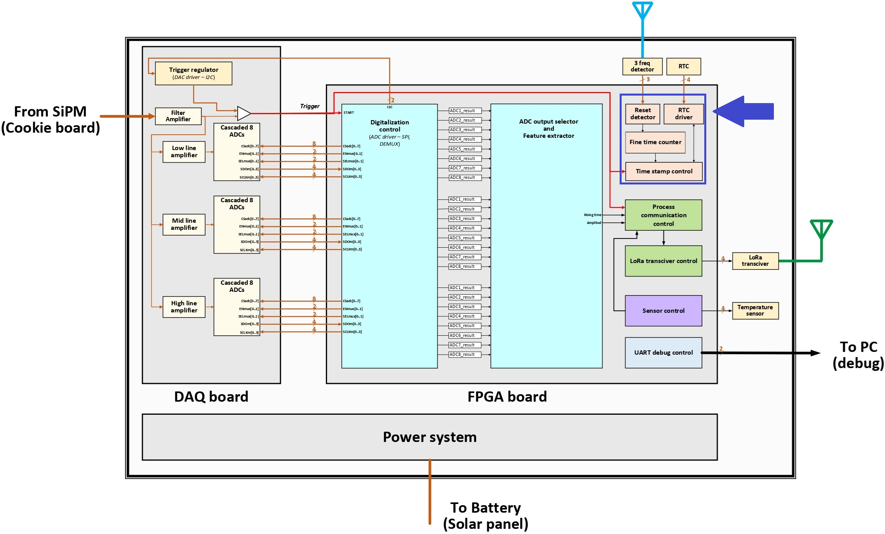
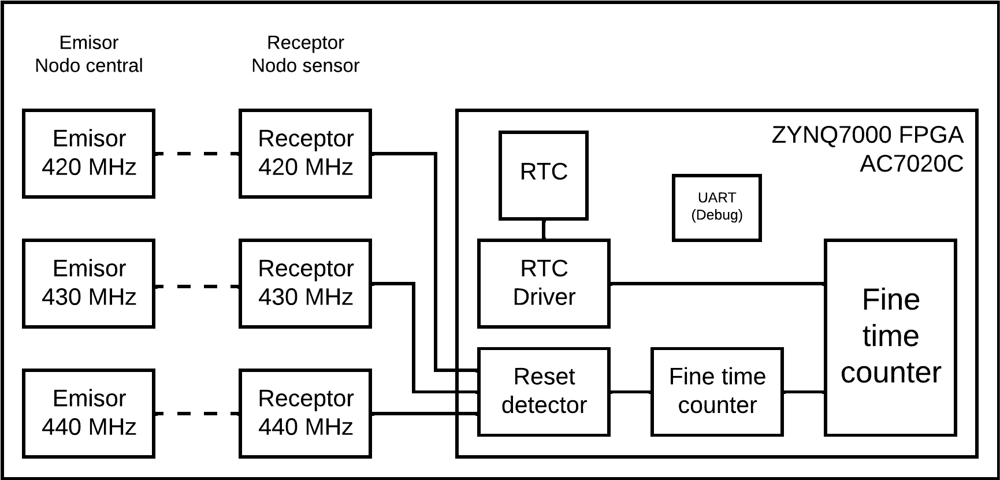

# Sincronizador

**Implementación del sincronizador en VHDL**

En este proyecto de Vivado, se encuentran los bloques relacionados con la sincronización del proyecto. Estos se pueden ver en la siguiente imagen, marcados dentro de un cuadrante de color morado.

Los bloques a implementar son: *reset detector*, *fine time counter*, *RTC driver* y *time stamp control*.

## Bloques

